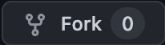

# Hai semua 👋
<!-- ALL-CONTRIBUTORS-BADGE:START - Do not remove or modify this section -->
[](#contributors-)
<!-- ALL-CONTRIBUTORS-BADGE:END -->

<!-- ALL-CONTRIBUTORS-BADGE:START - Do not remove or modify this section -->

<!-- ALL-CONTRIBUTORS-BADGE:END -->

di repo ini, temen" semua akan belajar bagaimana cara berkolaborasi di project HTML & CSS

1. Pertama fork dlu repo ini 

1. Buat `branch` kalian sendiri dengan mengambil dari `branch master`.

1. Pilih salah satu dari Issue yang sudah di list [disini](https://github.com/xxidbr9/binar-intro-to-html/issues)

1. Setelah itu, kalian wajib jalankan perintah `npm i` di terminal kalian

1. Dan setelah itu kalian bisa mulai buat folder berdasarkan username github kalian contoh `/contributors/xxidbr9` di folder `./contributors`, dan di isi dengan file `index.html` sebagai project html kalian, jangan lupa tambah link menuju folder di file `README.md` ini!!.

1. Kalian bisa lihat semua design di sini [LINK FIGMA](<https://www.figma.com/file/SG36PkOJmYIGpsr8mTsWZ1/Mobile-Templates-(Kampus-Merdeka)?type=design&node-id=0%3A344&mode=design&t=n1xd2OptGOKNULZr-1>)

1. Pastikan hilangkan status bar atas dan bar bawah dan Ganti gambar placeholder dengan gambar asli apapun.

1. Kalian wajib menggunakan screen mobile, bisa pakai yang sudah ada di chrome, atau untuk lebih presisi bisa pakai screen `iPhone 12` di chrome dev tools ataupun bisa memakai extension VSCode [Mobile View](https://marketplace.visualstudio.com/items?itemName=cirlorm.mobileview)

1. Untuk kalian yang sudah paham bisa lanjut buat bikin `pull request` dari `branch` yang sudah kalian buat.

1. Setiap `PR` atau `pull request` harus disertai Screen Shoot kalian dengan design yang sudah kalian buat, disertai informasi yang lengkap(termasuk issue number), contoh bisa lihat disini [(Link PR)](https://github.com/xxidbr9/binar-intro-to-html/pull/41)


### PERSYARATAN

Pesan commit harus rapi, dengan cara menambah beberapa prefix / kata khusus untuk di pakai di pesan commit, berikut beberapa list commit

#### List commit prefix Message

- feat : Pembuatan / Develope sebuah fitur baru
- fix : Membenarkan Bug di fitur yang sudah ada
- perf : Peningkatan / Meningkatkan performa dalam kode
- refactor : Mengganti full code yang sudah ada
- style : Merubah / Menambah Base Style System
- docs : Penambahan Documentasi file (.md)
- build : Merubah / Mengganti sesuatu yang mempengaruhi build (webpack,tailwind.config,postCss)
- ci : Commit yang mempengaruhi CICD
- test : Penambahan testing code seperti, Unit-test, Intregation Test, User Test


##### Contoh penulisan
```bash
git add . # Untuk menambah file sebelum di commit
git commit -m "feat: add navbar to html" # menggunakan prefix feat dan informasi singkat setelahnya 
```

##### Commit message dengan description

```bash
git commit -m "feat: allow provided config object to extend other configs"
```

```bash
feat: allow provided config object to extend other configs
```

##### Commit message dengan description dan body
dengan menggunakan lebih dari 1 Pesan (-m)
```bash
git commit -m "feat: allow provided config object to extend other configs" \
-m "BREAKING CHANGE: `extends` key in config file is now used for extending other config files"
```

```bash
feat: allow provided config object to extend other configs
BREAKING CHANGE: `extends` key in config file is now used for extending other config files
```

##### Commit message dengan scope
Menambah commit dengan (scope) / jangkauan pekerjaan
```bash
git commit -m "feat(xxidbr9): added xxidbr9 pages"
```

```bash
feat(xxidbr9): added xxidbr9 pages
```

##### Commit message dengan issue number.
ini akan membuat commit bisa membuat link dengan issue ataupun pull request yang ada di github
```bash
git commit -m "fix: remove unused #25"
```
```bash
fix: remove unused #25
```


### LIST KONTRIBUTOR

<!-- Tambah nama lengkap kalian dan link ke file yang kalian buat  -->
<!-- [nama_lengkap_kalian](./contributors/<username>) -->

- [Barnando Akbarto Hidayatullah](./contributors/xxidbr9)
- [Sandra Marsella] (./contributors/san033)

<!-- YANG DIBAWAH INI SAMPAI BAWAH JANGAN DI EDIT -->
<!-- INI OTOMATIS GENERATE DARI BOT -->

## Contributors ✨

Thanks goes to these wonderful people ([emoji key](https://allcontributors.org/docs/en/emoji-key)):
<!-- ALL-CONTRIBUTORS-LIST:START - Do not remove or modify this section -->
<!-- prettier-ignore-start -->
<!-- markdownlint-disable -->
<table>
  <tbody>
    <tr>
      <td align="center" valign="top" width="14.28%"><a href="http://github.com/xxidbr9-archived"><br /><sub><b>Barnando Akbarto Hidayatullah</b></sub></a><br /><a href="https://github.com/xxidbr9/binar-intro-to-html/commits?author=xxidbr9" title="Code">💻</a></td>
      <td align="center" valign="top" width="14.28%"><a href="https://github.com/San033"><br /><sub><b>Barnando Akbarto Hidayatullah</b></sub></a><br /><a href="https://github.com/xxidbr9/binar-intro-to-html/commits?author=san033" title="Code">💻</a></td>
    </tr>
  </tbody>
</table>

<!-- markdownlint-restore -->
<!-- prettier-ignore-end -->

<!-- ALL-CONTRIBUTORS-LIST:END -->

<!-- ALL-CONTRIBUTORS-LIST:START - Do not remove or modify this section -->
<!-- prettier-ignore-start -->
<!-- markdownlint-disable -->

<!-- markdownlint-restore -->
<!-- prettier-ignore-end -->

<!-- ALL-CONTRIBUTORS-LIST:END -->

This project follows the [all-contributors](https://github.com/all-contributors/all-contributors) specification. Contributions of any kind welcome!
